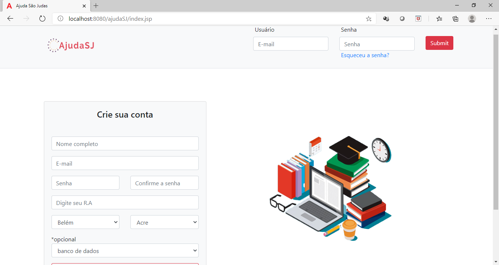
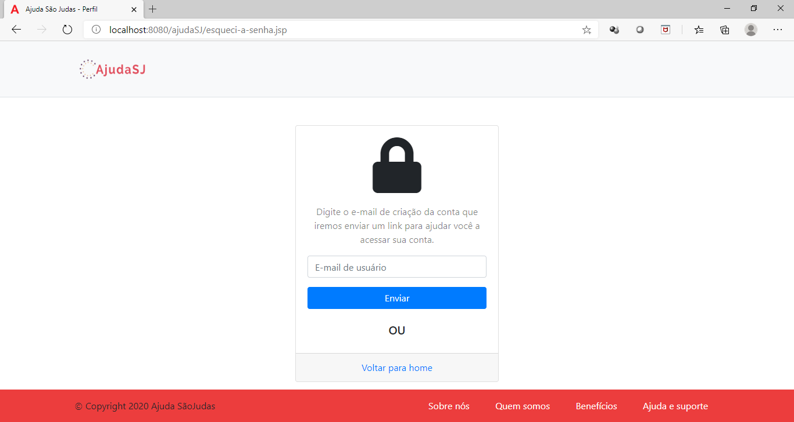

# ajudaSJ

## O que é?

O Ajuda São Judas (ajudaSJ) é um projeto que visa unir alunos que tem dificuldades com alunos que tem vontade de ensinar, foi desenvolvido pensando no caso específico da Universidade
São judas porém poderia ser facilmente implementado em qualquer outra instituição de ensino. Neste site é possível procurar um novo aluno para ensinar sobre determinada matéria,
e gerenciar quais aulas estão marcadas e quais solicitações chegaram, a cada nova aula ou solicitação é disparado um e-mail para que o participante saiba o que está acontecendo. 

Tudo é supervisionado por um administrador o qual pode fazer pequenas alterações no perfil de outros usuários e postar noticias relevantes sobre o site ou instituição de ensino. o ADM
Conta também com um dashboard para acompanhar cada aluno e um geral para acompanhar o quão movimentado está sendo o site.

## Tecnologias usadas?

- Javax Mail
- Java EE 
- Tomcat
- BootStrap
- JSTL
- JSP
